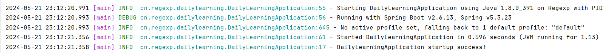

# coding-trainee

#### 项目介绍
coding-trainee（代码练习生），该项目主要包含日常学习、工作实践、案例分享等内容。在这里，我将分享自己日常积累的编程知识、编程技能，并通过实际案例分享学习成果和心得。

#### 分支说明

本项目分支主要分为四种，分别为 base、test、feature、demo，base 分支基于 master 拉取，其它分支基于 base 分支拉取。
- base: 基础模板代码的分支，比如 SpringBoot、SpringCloud等
- test: 代码测试用的分支，比如 Java、MySQL、Groovy 等
- feature: 实现某些功能的分支，比如接口操作记录、分布式链路 ID 实现方案等
- demo: 某些工具使用案例的分支，比如 Infinispan、Redis 使用案例等

#### 环境配置

JDK 1.8

#### IDEA配置

##### idea添加测试方法模板

#### 效果展示

