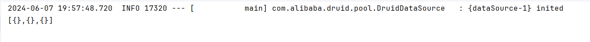

# coding-trainee

#### 项目介绍

coding-trainee（代码练习生），该项目主要包含日常学习、工作实践、案例分享等内容。在这里，我将分享自己日常积累的编程知识、编程技能，并通过实际案例分享学习成果和心得。

#### 分支说明

本项目分支主要分为四种，分别为 base、test、feature、demo，base 分支基于 master 拉取，其它分支基于 base 分支拉取。

- base: 基础模板代码的分支，比如 SpringBoot、SpringCloud等
- test: 代码测试用的分支，比如 Java、MySQL、Groovy 等
- feature: 实现某些功能的分支，比如接口操作记录、分布式链路 ID 实现方案等
- demo: 某些工具使用案例的分支，比如 Infinispan、Redis 使用案例等

#### 环境配置

JDK 1.8

#### IDEA配置

##### idea添加测试方法模板

## 多数据源

### 一、介绍

多数据源，也可以说是动态数据源。顾名思义，就是在一个项目中配置多个数据库连接源，
并且能够根据业务场景对数据源进行切换，从而提高系统的灵活性、可扩展性和可靠性。

### 二、应用场景

- **多租户支持**：SaaS 服务中，常会有多租户的场景，不同租户会对应不同数据库。
  那么，就需要根据当前租户来选择其对应的数据库，从而实现租户级别的隔离和数据存储。
- **读写分离**：通过配置主从数据库，实现写操作在主数据库上进行，读操作在从数据库上进行，以提高系统的性能和可扩展性。

### 三、相关类

`org.springframework.jdbc.datasource.lookup.AbstractRoutingDataSource`

**介绍**：Spring 中的一个重要抽象类，实现了 DataSource 接口，所以本质上也是一个 DataSource。

**作用**：允许开发者根据当前的执行环境或业务逻辑动态地切换到不同的数据源。

**主要方法**：

- `determineTargetDataSource()`：该方法用于获取当前的目标数据源标识符，通过该标识符从
  `org.springframework.jdbc.datasource.lookup.AbstractRoutingDataSource.resolvedDataSources` 中获取真正的数据源。
- `setTargetDataSources()`：该方法用于在项目启动时配置和设置多数据源。

---

`org.springframework.boot.autoconfigure.jdbc.DataSourceAutoConfiguration`

**作用**：用于自动配置所需的数据源，即在配置文件配置的 spring.datasource 相关信息都是通过这个类进行读取并注入完成数据源对象的创建。

---
`org.springframework.context.annotation.Primary`

**作用**：用于在多个相同类型的 bean 被定义时指定一个首选的 bean。

如果 Spring 容器中有多个相同类型的 bean，并且没有明确指出使用哪一个（比如使用 @Qualifier 注解），
那么此时 Spring 将无法确定注入哪个，会导致启动异常。

所以，我们可以使用 @Primary 注解来标记一个 bean 作为首选的 bean。

### 四、问题

#### 问题1：打印结果没有数据

**描述**：进行测试的时候，打印的列表个数是对的，但是没有数据

经过排查发现，User 这个类少了 get 和 set 方法，所以在类上添加 `@Getter` 和 `@Setter`

