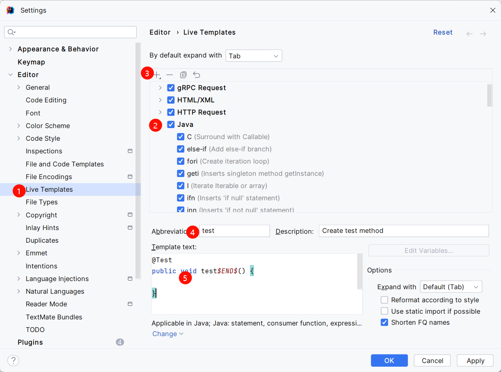
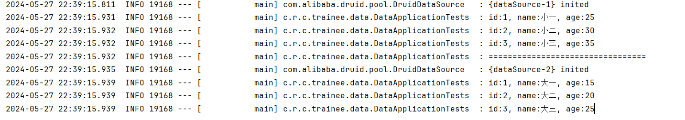

# coding-trainee

#### 项目介绍

coding-trainee（代码练习生），该项目主要包含日常学习、工作实践、案例分享等内容。在这里，我将分享自己日常积累的编程知识、编程技能，并通过实际案例分享学习成果和心得。

#### 分支说明

本项目分支主要分为四种，分别为 base、test、feature、demo，base 分支基于 master 拉取，其它分支基于 base 分支拉取。

- base: 基础模板代码的分支，比如 SpringBoot、SpringCloud等
- test: 代码测试用的分支，比如 Java、MySQL、Groovy 等
- feature: 实现某些功能的分支，比如接口操作记录、分布式链路 ID 实现方案等
- demo: 某些工具使用案例的分支，比如 Infinispan、Redis 使用案例等

#### 环境配置

JDK 1.8

#### IDEA配置

##### idea添加测试方法模板



### starter demo 介绍

在 Spring Boot 中，starter 启动依赖就像一个“开箱即用”的工具箱，它包含了第三方组件的配置和依赖，让我们无需手动配置和添加这些组件。

通过 starter，我们可以轻松地将通用的代码和配置整合成一个可复用的模块，从而简化项目搭建和代码管理，让开发人员更加专注于业务功能的开发。

#### 自定义 starter 步骤

1. 创建 Maven 项目，命名规范为 xxx-spring-boot-starter
2. 引入依赖
    ```xml
    <dependencies>
        <dependency>
            <groupId>org.springframework.boot</groupId>
            <artifactId>spring-boot-starter</artifactId>
        </dependency>
        <dependency>
            <groupId>org.springframework.boot</groupId>
            <artifactId>spring-boot-autoconfigure</artifactId>
        </dependency>
        <dependency>
            <groupId>org.springframework.boot</groupId>
            <artifactId>spring-boot-configuration-processor</artifactId>
        </dependency>
    </dependencies>
    ```
3. 定义 XxxProperties 属性配置类，用于绑定 application.yaml 或 application.properties 文件中的配置属性
4. 编写业务类，根据 starter 的功能需要编写业务逻辑
5. 配置 XxxAutoConfiguration 自动配置类
   - 使用 `@Configuration` 标记为配置类
   - 使用 `@EnableConfigurationProperties(XxxProperties.class)` 绑定配置属性类
6. 创建 resources/META-INF/spring.factories
    ```factories
    org.springframework.boot.autoconfigure.EnableAutoConfiguration=\  
    xxx.xxx.xxx.XxxAutoConfiguration
    ```
7. 在项目中引入 starter
    ```xml
    <dependency>
        <groupId>xxx.xxx</groupId>
        <artifactId>xxx-spring-boot-starter</artifactId>
        <version>1.0.0</version>
    </dependency>
    ```

#### 效果展示

