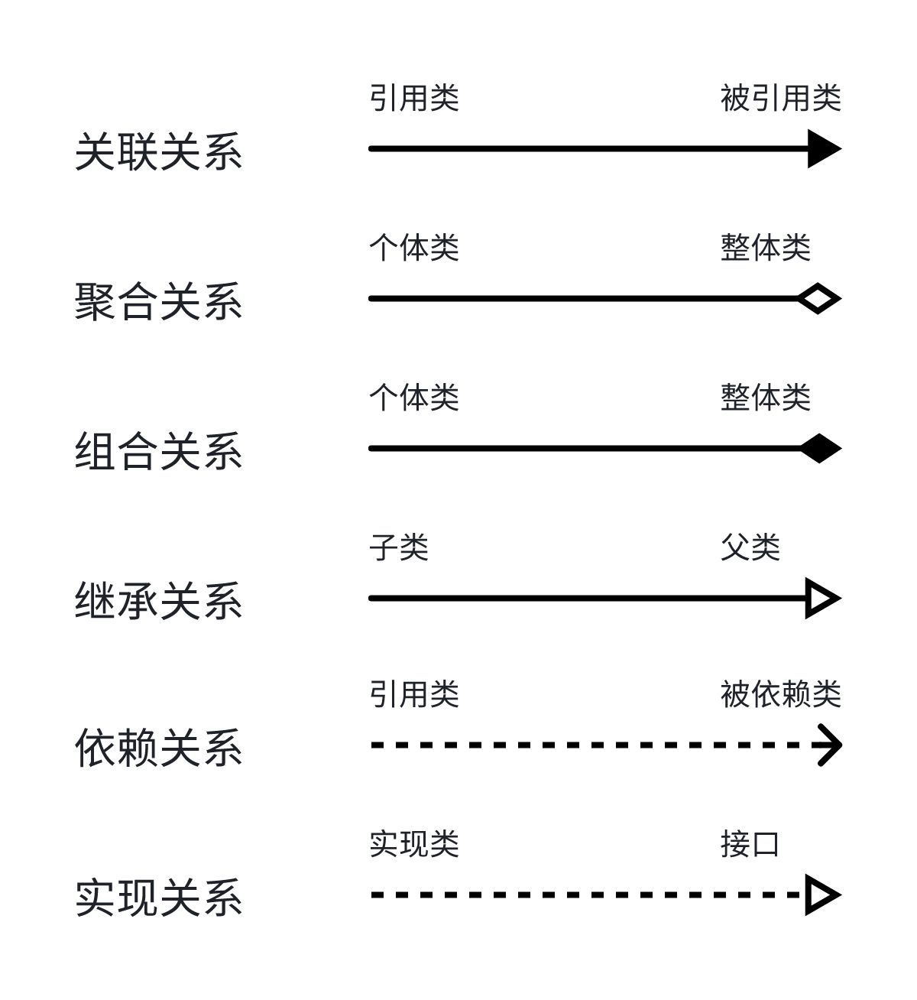

## 设计模式

### 一、概述
所谓设计模式，其实就是**一套能够被反复使用的方法论**，是前辈们对于**代码设计的经验总结**。
合理使用设计模式，能够让代码更加简洁、灵活，提高代码可重用性，减少重复代码。

### 二、分类
#### 创建型模式（5种）
> 将对象的创建和使用进行分离，创建对象的人不需要知道对象如何被使用，使用对象的人也不需要知道对象如何被创建。

- 工厂模式（Factory Pattern） 
- 抽象工厂模式（Abstract Factory Pattern） 
- 单例模式（Singleton Pattern） 
- 建造者模式（Builder Pattern） 
- 原型模式（Prototype Pattern）

#### 结构型模式（7种）
> 将类和对象通过不同的组合方式构建出更加复杂的类、对象。比如，乐高积木模型由许多不同形状和大小的积木块组成，这些积木块可以单独使用，也可以组合在一起形成更复杂的结构。

- 适配器模式（Adapter Pattern）
- 桥接模式（Bridge Pattern）
- 组合模式（Composite Pattern）
- 装饰器模式（Decorator Pattern）
- 外观模式（Facade Pattern）
- 享元模式（Flyweight Pattern）
- 代理模式（Proxy Pattern）

#### 行为型模式（11种）
> 关注的是对象之间的通信和协作，通过共同协作、职责分配完成单个对象无法完成的任务。 大概就是一个小组有UI设计、前端开发、后端开发、测试等人员共同协作完成一个项目，并且每个人的职责都不同。
- 责任链模式（Chain of Responsibility Pattern）
- 命令模式（Command Pattern）
- 解释器模式（Interpreter Pattern）
- 迭代器模式（Iterator Pattern）
- 中介者模式（Mediator Pattern）
- 备忘录模式（Memento Pattern）
- 观察者模式（Observer Pattern）
- 状态模式（State Pattern）
- 策略模式（Strategy Pattern）
- 模板模式（Template Pattern）
- 访问者模式（Visitor Pattern）

### 三、UML

UML（Unified Modeling Language，统一建模语言）是一种用于对软件密集系统进行**可视化建模**的一种标准语言。它提供了丰富的图形符号来描述系统的结构、行为、交互以及它们之间的关系。UML 旨在将不同的建模技术、方法和图形符号统一到一个公共的、可理解的和易于使用的符号集中。

> 说人话，就是将类、对象、代码逻辑、工作流程等一系列与软件系统相关的内容进行可视化。

#### 类之间的关系
- **关联关系**
- **聚合关系**：强关联关系，整体与部分，部分可以脱离整体而独立存在。
- **组合关系**：强聚合关系，整体决定部分，部分无法独立存在。
- **继承关系**：耦合度最大，表示一般与特殊、父类与子类的关系。
- **依赖关系**：耦合度最弱，临时性的关联。在代码层面，依赖关系通常表现为一个类将另一个类作为参数、局部变量或返回类型来使用。例如，一个 Person 类可能有一个 driveToWork 方法，该方法需要一个 Car 类型的参数。
- **实现关系**：接口和实现类之间的关系。

### 四、软件设计原则

#### 1. 开闭原则（Open Close Principle）

**对扩展开放，对修改关闭**。当需要改变一个程序的行为时，应该通过增加新增代码的方式来实现，而不是修改已有的代码。

> 在电商支付模块中，通常都会有多种支付方式，如果在最开始设计的时候能够遵循开闭原则，则在后续需要新增支付方式时就不需要去修改原来的代码，只需要扩展支付接口，然后实现支付具体逻辑即可。

参考：[OCPTest](../src/test/java/cn/regexp/coding/trainee/principles/OCPTest.java)

#### 2. 里氏代换原则（Liskov Substitution Principle）

任何基类可以出现的地方，子类一定可以出现。简单地说，就是**子类继承父类时，能够扩展父类的功能，但不能改变父类原有的功能**。因此，在使用继承时，要尽可能地不去重写父类中已经实现的方法。

> 假如你爸开了一家猪脚饭店，子承父业，你也开了猪脚饭店，继承你老爸卤猪脚的手艺，那么根据里氏代换原则，你可以在猪脚饭上加点青菜、配个汤啥的，但是卤猪脚的配方不能变，因为你一旦改了配方，你老爸换成你来卤猪脚味道就变了。

#### 3. 依赖倒转原则（Dependence Inversion Principle）

高层模块不应该依赖于低层模块，它们都应该依赖于抽象。

简单地地说，就是**面向接口编程**，比如对于方法中的参数，尽可能传递接口或抽象类，而不是接口或抽象类的具体实现类。

#### 4. 接口隔离原则（Interface Segregation Principle）

客户端不应该依赖它不需要的接口。一个类对另一个类的依赖应该建立在最小的接口上。

也就是说，一个接口所具有的行为应当是小而完备的。当接口的行为过多时，包含很多实现类所不需要的方法时，就应该将接口拆分成多个更小的接口，让不同的实现类分别去依赖它所需要的接口、实现它所需要的方法。

#### 5. 迪米特法则，又称最少知道原则（Demeter Principle）

“只与你的直接朋友交谈，不跟陌生人说话。”如果两个软件实体无须直接通信，那么就不应当发生直接的相互调用，可以通过第三方转发该调用。

类似于中介，租客不于房主直接租房，而是通过中介进行租房，房主找到中介办理出租，而租客通过中介租房子。

#### 6. 合成复用原则（Composite Reuse Principle）

强调通过对象之间的组合或聚合关系来实现代码的复用，而不是通过继承关系。当想要复用已有的代码或功能时，应首先考虑通过聚合和组合的方式，将已有对象作为新对象的一部分来使用，而不是通过继承方式。

#### 遵循以上规则的目的：高内聚，低耦合

