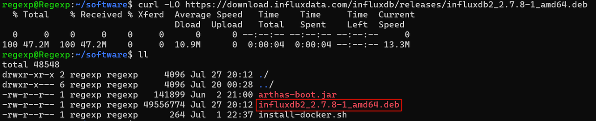
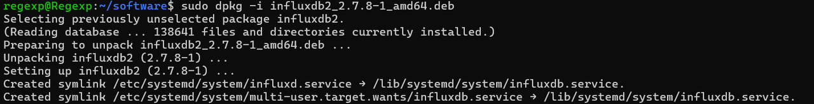

## 一、安装 InfluxDB
### Windows
#### 1. 下载安装包
下载链接：https://download.influxdata.com/influxdb/releases/influxdb2-2.7.8-windows.zip

#### 2. 解压压缩包
#### 3. 创建一键启动文件

在解压文件夹内（即 influxd.exe 所在路径）下，创建 startup.bat 文件，内容如下：
```
influxd.exe --reporting-disabled
```
#### 4. 双击文件，启动服务
#### 5. 访问控制台
默认为 localhost:8086

### Ubuntu

> **环境**：Windows 11、WSL 2、Ubuntu 22.04.4 LTS

#### 1. 下载和安装软件包
```shell
# Ubuntu/Debian AMD64
curl -LO https://download.influxdata.com/influxdb/releases/influxdb2_2.7.8-1_amd64.deb
sudo dpkg -i influxdb2_2.7.8-1_amd64.deb
```
**命令解释**：

**curl**: 命令行工具，用于传输数据，支持多种协议，包括 HTTP、HTTPS、FTP 等。
- -L: 告诉 curl 跟随重定向。当请求的 URL 指向一个重定向（比如一个 301 或 302 HTTP 状态码）时，curl 会自动跟随这个重定向到最终的目标 URL。
对于下载可能由于版本更新或其他原因而更改了下载链接的文件非常有用。
- -O: 告诉 curl 使用服务器指定的文件名来保存下载的文件。如果服务器响应的 Content-Disposition 头部包含了文件名，curl 就会使用那个文件名；
如果没有，curl 会尝试从 URL 中提取文件名。如果 URL 指向的是一个文件，那么通常会使用 URL 的最后一部分作为文件名。

**dpkg**: Debian软件包管理器，用于安装、构建、删除和管理 Debian 软件包。
- -i: 执行安装软件包操作，后面跟需要安装的软件包名




#### 2. 启动服务

```shell
sudo service influxdb start
```
执行后显示：influxdb: unrecognized service，是因为用的是 WSL，不支持 service？

```shell
which influxd
```
通过以上命令能够查询到 influxd 命令的位置：/usr/bin/influxd，既然存在，那就直接执行

```shell
# & 表示让这个进程在后台运行
influxd &
```

#### 3. 查看服务是否启动
```shell
ps -ef | grep influxd
```

## 二、安装 Telegraf

参考网站：https://www.influxdata.com/downloads/

### Ubuntu

#### 1. 安装
```shell
# influxdata-archive_compat.key GPG fingerprint:
#     9D53 9D90 D332 8DC7 D6C8 D3B9 D8FF 8E1F 7DF8 B07E

# 下载 GPG 密钥，GPG 密钥用于验证从 InfluxData 仓库下载的软件包的完整性和真实性。-q 参数表示在下载过程中不输出任何信息
wget -q https://repos.influxdata.com/influxdata-archive_compat.key
# 验证GPG密钥的SHA256哈希值
echo '393e8779c89ac8d958f81f942f9ad7fb82a25e133faddaf92e15b16e6ac9ce4c influxdata-archive_compat.key' | sha256sum -c && cat influxdata-archive_compat.key | gpg --dearmor | sudo tee /etc/apt/trusted.gpg.d/influxdata-archive_compat.gpg > /dev/null
# 添加 APT 源
echo 'deb [signed-by=/etc/apt/trusted.gpg.d/influxdata-archive_compat.gpg] https://repos.influxdata.com/debian stable main' | sudo tee /etc/apt/sources.list.d/influxdata.list
# 更新 APT 源并安装 Telegraf
sudo apt-get update && sudo apt-get install telegraf
```
#### 2. 配置 API token（根据实际情况配置）

```shell
export INFLUX_TOKEN=xxx
```

#### 3. 启动 Telegraf（根据实际情况配置）

```shell
telegraf --config http://localhost:8086/api/v2/telegrafs/0d6a0b8bd2b70000 &
```

## 三、安装 node_exporter

参考网站：https://prometheus.io/download/#nodeexporter

#### 1. 下载安装包
```shell
wget https://github.com/prometheus/node_exporter/releases/download/v1.8.2/node_exporter-1.8.2.linux-amd64.tar.gz
```

#### 2. 解压安装包

```shell
tar -xvf node_exporter-1.8.2.linux-amd64.tar.gz
```
#### 3. 启动服务
```shell
cd node_exporter-1.8.2.linux-amd64
./node_exporter &
```

## 四、配置 HTTPS

> <p style="color: red;font-weight: bolder;font-size: 16px">注意：</p>
> 从 http 升级到 https，需要考虑原来配置的 url 是否需要进行更改，否则会报错！

### 1. 使用 openssl 生成证书
命令模板：
```shell
sudo openssl req -x509 -nodes -newkey rsa:2048 \
  -keyout /etc/ssl/influxdb-selfsigned.key \
  -out /etc/ssl/influxdb-selfsigned.crt \
  -days <NUMBER_OF_DAYS>
```
命令解释：
- **req -x509**: 指定生成自签名证书的格式。
- **-newkey rsa:2048**: 生成证书请求或者自签名整数时自动生成密钥，然后生成的密钥名称由 keyout 指定。rsa:2048 意思是产生 rsa 密钥，位数是 2048。
- **-keyout**: 指定生成的密钥名称。
- **-out**: 证书的保存路径
- **-days**: 证书的有效期限，单位是 day（天），默认是 365 天。

命令参考：
```shell
sudo openssl req -x509 -nodes -newkey rsa:2048 \
  -keyout /etc/ssl/influxdb-selfsigned.key \
  -out /etc/ssl/influxdb-selfsigned.crt \
  -days 365
```
执行之后一直回车即可。

#### 2. 确保启动 influxd 的用户对密钥整数文件有读取权限

如果没有，则执行以下命令：
```shell
sudo chmod 755 /etc/ssl/influxdb-selfsigned.key
sudo chmod 755 /etc/ssl/influxdb-selfsigned.crt
```
#### 3. 停止旧的 influxd 服务

```shell
kill $(pgrep influxd)
```

#### 4. 启动 influxd 服务时指定证书和密钥路径
> 确保证书路径一致
```shell
influxd \
  --tls-cert="/etc/ssl/influxdb-selfsigned.crt" \
  --tls-key="/etc/ssl/influxdb-selfsigned.key" &
```


