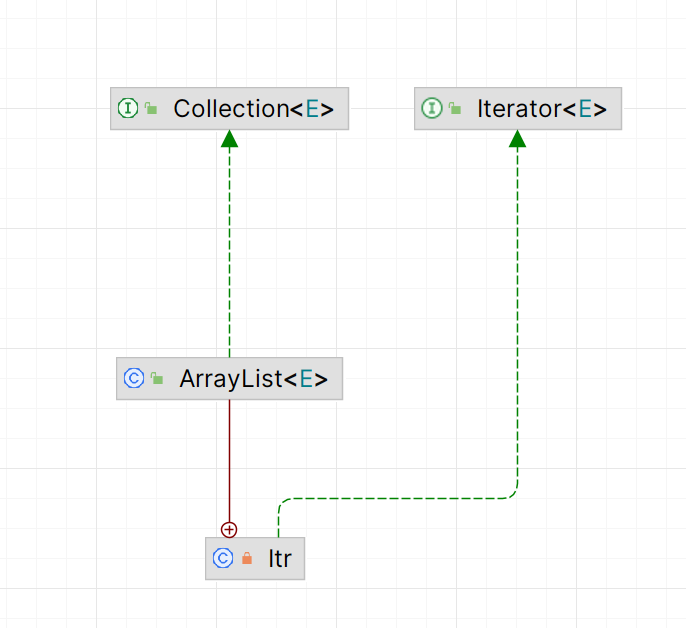
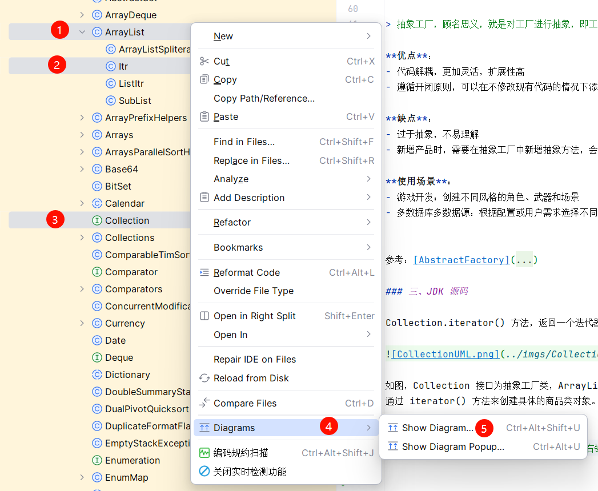

## 工厂模式（Factory Pattern） 

### 一、介绍

工厂模式，就是提供一个接口或抽象类来**封装对象的创建过程**，需要用到什么对象告诉工厂即可获得相应对象，无需自己使用 new 来创建对象。

工厂模式将对象的创建与使用相分离，降低了代码的耦合度，提高了系统的灵活性和可维护性。

在 JDK 中的 Calendar、MyBatis 的 SqlSessionFactory 、Spring 的 BeanFactory 中都采用了工厂模式进行实现。

**实现方式（3种）：**
- **简单工厂模式**
- **工厂方法模式**
- **抽象工厂模式**

### 二、实现

#### 1. 简单工厂模式

简单工厂模式，又叫做静态工厂模式，意思是只有一个工厂来负责生产所有需要的产品对象。

**优点**：
- 封装性好：用户无需知道内部的创建过程
- 扩展性较好：当有新的产品，只需要新增该产品并修改工厂类即可，不需要修改其它产品代码

**缺点**：
- 违反开闭原则：当需要新增产品时，需要修改工厂类
- 工厂类职责过重：随着产品增多，工厂类的代码会越来越多

**适用场景**：
- 产品类型较少且变化不大
- 不需要外界考虑产品的创建过程

参考：[SimpleFactory](../src/main/java/cn/regexp/coding/trainee/pattern/factory/simple)

#### 2. 工厂方法模式

工厂方法模式，又叫做多态工厂模式，即父类只负责定义创建对象的公共接口，而具体对象的生成由子类进行负责。

> 简单说，就是一个产品由一个工厂生产。

**优点**：
- 延迟实例化：让类的实例化推迟到子类中进行
- 符合开闭原则：新增产品，无需修改原有的工厂和产品，只需要提供一个新的工厂和新的产品即可

**缺点**：
- 复杂度增加：每多一个产品就需要新增一个工厂和一个产品

**使用场景**：
- 图形库：创建不同类型的图形对象，如圆形、矩形、椭圆形等
- 数据库连接：创建不同类型的数据库连接对象

参考：[FactoryMethod](../src/main/java/cn/regexp/coding/trainee/pattern/factory/method)

#### 3. 抽象工厂模式

抽象工厂模式是一种提供接口以创建一组相互关联或相互依赖的对象的模式，而无需指定它们的具体类，用于产品族的构建。

> 抽象工厂，顾名思义，就是对工厂进行抽象，即工厂的工厂，它是对工厂方法的一种改进。通过这种模式，我们能够根据所需要的对象类型来获取工厂子类，通过工厂子类来创建具体的对象。

**优点**：
- 代码解耦，更加灵活，扩展性高
- 遵循开闭原则，可以在不修改现有代码的情况下添加新的产品族

**缺点**：
- 过于抽象，不易理解
- 新增产品时，需要在抽象工厂中新增抽象方法，会涉及到所有工厂类修改

**使用场景**：
- 游戏开发：创建不同风格的角色、武器和场景
- 多数据库多数据源：根据配置或用户需求选择不同的数据库系列

参考：[AbstractFactory](../src/main/java/cn/regexp/coding/trainee/pattern/factory/ebstract)

### 三、JDK 源码

Collection.iterator() 方法，返回一个迭代器，迭代器中包含一个工厂类，通过工厂类来创建迭代器。

如图，Collection 接口为抽象工厂类，ArrayList 为具体工厂类，Iterator 接口为抽象产品类，ArrayList 中的 Iter 内部类为具体产品类，
通过 iterator() 方法来创建具体的产品类对象。

> **通过 IDEA 查看 UML图方法**：
> 
> 使用 Ctrl + 鼠标单击 选中需要展示的类，右键选中 Diagrams -> Show Diagram.../Show Diagrams Popup...
> 
> 
