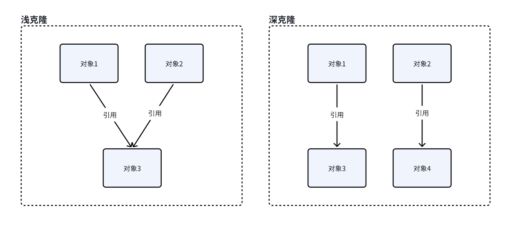

## 原型模式（Prototype Pattern）

### 一、介绍

原型模式（Prototype Pattern）是一种创建型模式，又叫做克隆模式，用于**创建重复**的对象，同时又能保证性能。

**使用场景**：
- 创建对象成本较大，而其复制过程消耗小。
- 性能和安全要求比较高。

### 二、结构

- **抽象原型类**：主要规定了具体原型对象必须要实现的 clone() 方法。简单说，就是一个接口包含一个 clone() 方法。
- **具体原型类**：实现抽象原型类中的 clone() 方法，用于返回当前对象的拷贝。被克隆对象的类需要实现 clone() 方法，这样外界才能够调用该方法进行克隆。
- **访问类**：使用具体原型类中的 clone() 方法来复制新的对象。

### 三、分类

原型模式，又叫做克隆模式，那自然而然会想到**浅克隆**和**深克隆**。

所谓浅克隆，就是对于对象中的引用类型对象，克隆出的对象中的引用类型对象依然会引用原有的对象。

而深克隆，是对原对象的完全克隆，会将原对象中的所有引用类型对象都克隆一份出来。



### 四、实现

Java 中的 Object 类提供了 clone() 方法，用于实现对象的克隆，**实现 clone() 方法的类必须实现 Cloneable 接口，
否则会抛出 CloneNotSupportedException 异常。**

Cloneable 接口是一个**标记接口**，类似 Serializable 接口，它没有任何方法，只是用来标识一个类**支持克隆**操作。

#### 1. 浅克隆

参考：[shallow](../src/main/java/cn/regexp/coding/trainee/pattern/prototype/shallow)

#### 2. 深克隆

- **序列化和反序列化**，被克隆类实现 Serializable 接口，通过输入输出流实现克隆。
- **实现 Cloneable 接口**，将被克隆对象中的引用类型对象全部实现 Cloneable 接口，并在被克隆对象的 clone() 方法中进行重新赋值。
- **第三方工具**，比如`cn.hutool.core.util.ObjectUtil.clone`、FastJson 转为字符串再转回对象等。

参考：[deep](../src/main/java/cn/regexp/coding/trainee/pattern/prototype/deep)

### 五、实际应用

**需求**：根据传入的文件信息，生成一份除文件名不同但其它都相同的文件。

参考：[file](../src/main/java/cn/regexp/coding/trainee/pattern/prototype/file)

### 六、源码解析

从 Object 类中可以看到 clone() 一个 native 方法，采用 C++ 实现，因此执行性能很高。

```java
protected native Object clone() throws CloneNotSupportedException;
```

对于数组类型的克隆，可以使用 `Arrays.copyOf()`，从源码来看，也是调用了 native 方法。 经过测试，`Arrays.copyOf()` 是一个浅克隆。

参考：[PrototypeTest#testArraysCopyOf](../src/test/java/cn/regexp/coding/trainee/pattern/PrototypeTest.java)

```java
/*
 * @param      src      原数组
 * @param      srcPos   原数组起始位置
 * @param      dest     目标数组
 * @param      destPos  目标数组起始位置
 * @param      length   复制的长度
 */
public static native void arraycopy(Object src, int srcPos, Object dest, int destPos, int length);
```