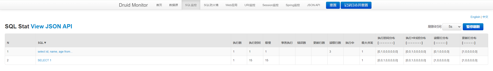

## Druid Monitor

### 一、介绍

Druid 是一个开源的、高性能的数据库连接池，由阿里巴巴开发并维护。

而 Druid Monitor 则是 Druid 中内置的一个**监控工具**，用于实时监控数据库连接池的运行状态、性能指标以及SQL执行情况等。

通过 Druid Monitor，我们可以对数据源、慢查询、SQL、URI、Session 等内容进行监控，从而及时发现潜在的问题并进行优化。

- **监控数据源**：能够实时监控数据源（如 MySQL、Oracle 等）的连接数、活跃连接数、空闲连接数、等待连接数等指标
- **监控慢查询**：记录并展示慢查询日志，通过配置慢查询阈值，可以自动记录执行时间超过阈值的 SQL 语句
- **SQL 监控**：实时监控 SQL 语句的执行情况，包括执行时间、执行次数、并发数等指标
- **URI 监控**：监控 Web 应用的 URI 请求情况，包括请求次数、响应时间等指标
- **Session 监控**：监控用户的 Session 情况，包括 Session 数量、活跃 Session 数、Session 创建时间等指标

参考资料：https://github.com/alibaba/druid/tree/master/druid-spring-boot-starter

### 二、简单使用

> 以下内容为主要内容，其余内容请看项目具体文件

1. 添加依赖 [pom.xml](../pom.xml)
    ```xml
    <dependency>
        <groupId>com.alibaba</groupId>
        <artifactId>druid-spring-boot-starter</artifactId>
        <version>1.2.16</version>
    </dependency>
    ```
2. 添加配置 [application.properties](../src/main/resources/application.properties)
    ```properties
   ## Druid 内置监控
   # 开启监控
   spring.datasource.druid.stat-view-servlet.enabled=true
   # 启用 stat 过滤器，用于统计监控信息，不配置执行的 SQL 将不会被统计
   spring.datasource.druid.filters=stat
    ```

3. 效果展示：


### 三、进阶使用

以上仅仅只是对 Druid Monitor 使用的一个最简单配置使用案例，而 Druid 其实提供了很多丰富的配置供开发人员进行设置。

对于实际中的企业项目，特别是上线并对外开放的项目，安全性是至关重要的。而对于上述的配置，只要有人具有部署这个应用的机器权限，就可以访问到
Druid Monitor，这还是挺危险的！

那么，我们可以考虑对这个 Druid Monitor 的访问权限进行控制，比如设置账号密码登录、限制 IP 登录等操作。

##### 配置账号密码

```properties
# 登录用户
spring.datasource.druid.stat-view-servlet.login-username=regexp
# 登录密码
spring.datasource.druid.stat-view-servlet.login-password=regexp
```

##### 配置访问IP

```properties
# 允许访问的 IP，默认为本地（可以看下自己手机连接的 WiFi IP，进行测试）
spring.datasource.druid.stat-view-servlet.allow=192.168.0.1
# 禁止访问的 IP
spring.datasource.druid.stat-view-servlet.deny=127.0.0.1
```

>
从源码[com.alibaba.druid.spring.boot.autoconfigure.stat.DruidStatViewServletConfiguration.statViewServletRegistrationBean]
中可以看出，当项目配置文件中没有配置允许访问的 IP 时，默认设置为本地

#### 配置禁止重置

在 Druid Monitor 页面，导航栏有两个按钮“重置”和“记录日志并重置”，触发后会将所有的统计记录清零重新开始。

为了避免别人误操作导致数据丢失，可以通过配置进行避免。

如下：

```properties
# 禁止重置 stat
spring.datasource.druid.stat-view-servlet.reset-enable=false
```

> **注意**：当设置为 false 时，表示禁止重置，但按钮依然在，依然能够操作，只不过操作后并不会清除统计记录。

### 四、其它

1. 清除 Druid Monitor
   页面底部的广告图，具体实现查看 [ClearDruidAdConfiguration](../src/main/java/cn/regexp/coding/trainee/config/ClearDruidAdConfiguration.java)


